# Keeper — AI Pipeline & Grounding Architecture

*Last Updated: 2026-10-02*

Keeper implements an evidence-grounded AI pipeline designed to summarize, classify, and extract structured metadata from saved content **without hallucination**.

---

## Separation: Source Content vs. AI-Generated Content

A fundamental architectural invariant in Keeper is the strict separation between what the creator originally posted and what the AI derives:

```mermaid
flowchart LR
    subgraph SourceFacts ["SOURCE FACTS (Immutable)"]
        AuthorCaption["originalCaption / description"]
        AuthorName["creator.name / handle"]
        SourceURL["canonicalUrl"]
    end

    subgraph GroundedAI ["AI-GENERATED LAYER (Derived)"]
        QuickTLDR["aiSummary.quick"]
        StandardSum["aiSummary.standard"]
        DetailedSum["aiSummary.detailed"]
        Category["category & topics"]
        Intent["contentIntent"]
        Tags["tags & keywords"]
    end

    SourceFacts -.->|Feeds evidence into| GroundedAI
    GroundedAI -.->|NEVER overwrites| SourceFacts
```



- **Source Facts**: Stored on `SavedItem.description`, `SavedItem.creator`, `SavedItem.url`, and `SavedItem.savedDate`. Provenance is tagged with `source: "instagram_export_metadata"` or `source: "youtube_metadata"`.
- **AI-Generated**: Stored on `SavedItem.aiSummary`, `SavedItem.topics`, `SavedItem.tags`, and `SavedItem.metadata.contentIntent`. Provenance is tagged with `source: "ai_grounded_pipeline"`.

---

## The Grounded AI Enrichment Pipeline (`AIPipeline.enrichContent`)

Located in [`src/services/ai-pipeline.ts`](file:///Volumes/T7/Devang/Code/Real_Project/Keeper/src/services/ai-pipeline.ts#L220), the pipeline receives `AuthoritativeSourceData` and executes four deterministic grounding stages:

### Stage 1: Evidence Availability & Restriction Detection
The pipeline inspects `evidence.isRestricted`, text length, and available fields:
- If the content was login-blocked by Instagram/Reddit and has no meaningful caption or transcript:
  - `status`: `"INSUFFICIENT_CONTENT"`
  - `confidence`: `0.1`
  - `isSufficientContent`: `false`
  - Summary output: `"Insufficient content available for reliable AI analysis. We saved this resource, but caption, transcript, and creator details were restricted by the platform."`
  - **No hallucination**: The AI explicitly refuses to invent content.

### Stage 2: Intent Categorization & Topic Modeling
Content text (title, caption, description, transcript) is analyzed against strict word-boundary token rules to assign canonical categories:
- **`RESOURCE`**: Template distributions, Figma UI kits, asset packs (e.g. matching `"comment asset"`, `"comment template"`).
- **`TUTORIAL`**: Step-by-step guides, workflow automation (Make.com, n8n, Zapier), video editing.
- **`NEWS`**: Societal discussions, labor laws, policy updates.
- **`technical`**: Frontend code, React, TypeScript, AI agents, LLM architectures.
- **`inspiration`**: Visual polish, design tokens, typography, UI/UX aesthetics.
- **`lifestyle`**: Travel itineraries, transit guides, rail journeys.
- **`bookmark`**: Minimal context or generic links.

### Stage 3: Multi-Tier Summary Generation
Generates three distinct lengths suitable for different UI contexts:
1. `quick`: A single sentence TL;DR for quick list scanning.
2. `standard`: A 2–3 sentence cohesive overview for item cards and detail headers.
3. `detailed`: A structured multi-line breakdown covering key context, background, and platform source.

### Stage 4: Suggested Collection & Tag Sanitization
- Evaluates similarity against existing user collections using weighted token overlap (threshold: `0.35`).
- Runs extracted tags through [`MetadataNormalizer.sanitizeTags`](file:///Volumes/T7/Devang/Code/Real_Project/Keeper/src/services/normalizer/metadata-normalizer.ts#L40) to strip noise, normalize casing, and deduplicate.

---

## Conversational AI Assistant (`AIService.query`)

Located in [`src/services/ai-service.ts`](file:///Volumes/T7/Devang/Code/Real_Project/Keeper/src/services/ai-service.ts#L120):
- **Retrieval Augmented Generation (RAG)**: Takes the user's natural language question, searches the user's saved items using `SearchService`, and grounds the answer directly in the matched item summaries.
- **Citations**: Returns `referencedItemIds` so the UI can render clickable preview chips linking directly to the cited sources.
- **Insights & Follow-ups**: Extracts key takeaways and suggests relevant exploratory questions.

---

## Media Processing & Organization Services

### `TranscriptionService`
Located in [`src/services/media/transcription-service.ts`](file:///Volumes/T7/Devang/Code/Real_Project/Keeper/src/services/media/transcription-service.ts):
- **Media Resolution**: Checks `item.metadata.mediaBuffer`, local export archive media (`ZipArchiveReader`), or verified provider cache.
- **Cost Control**: Reuses existing `item.metadata.transcript` if already completed.
- **Provider Invocation**: Bounded 10s execution timeout with fallback.
- **Language Detection & Provenance**: Normalizes transcript text, detects language, and attaches provenance.
- **Honest Fallback**: When media is restricted or absent, returns `{ status: "unavailable", text: "", reason: "..." }` rather than inventing text.

### `CollectionOrganizerService`
Located in [`src/services/collection-organizer-service.ts`](file:///Volumes/T7/Devang/Code/Real_Project/Keeper/src/services/collection-organizer-service.ts):
- **Multi-Stage Fusion**:
  ```
  Media Acquisition -> Audio Transcription -> Evidence Aggregation -> Structured Semantic Understanding -> Hierarchical Collection Matching -> Confidence Gating -> Safe Persistence
  ```
- **Semantic Intent Taxonomy**:
  - `RESOURCE_ACQUISITION`: Detects triggers (e.g. comment "PRESET", DM "TEMPLATE", "link in bio") and extracts `{ action, trigger, confidence }`.
  - `TUTORIAL`: Step-by-step guides (e.g. Premiere Pro transitions, Blender modeling, n8n automations).
  - `LEARNING`: Theoretical, architectural, and educational concepts.
  - `TOOL`: Standalone utilities, software tools, extensions.
  - `INSPIRATION`, `REFERENCE`, `BUSINESS`, `ENTERTAINMENT`, `OTHER`.
- **Hierarchical Matching with Existing Collection Preference**:
  - Maps specific concepts into broader existing categories (e.g., Premiere Pro -> "Video Editing", n8n -> "AI & Automation").
  - Prevents collection explosion by disallowing one-off single-item collection creation without explicit user approval.
- **Confidence Gating**:
  - High Confidence (`>= 0.75`): Auto-assigned (`APPLIED`).
  - Medium Confidence (`0.50 - 0.74`): Suggested for user review (`SUGGESTED`).
  - Low Confidence (`< 0.50`): Left in General Library (`UNCERTAIN`).
- **Safe Persistence**:
  - All updates mutate ONLY derived fields (`metadata.transcript`, `metadata.organization`, `collectionId`, `tags`) via `ContentService.updateItem` (which calls `ContentService.safeMerge`).
  - Authoritative source fields (`url`, `creator`, original `caption`/`description`, `savedDate`, `shortcode`, `fbid`) are immutable.
# Asynchronous processing update (2026-10-07)

The old synchronous transcription description above documents the prototype path only. Active URL imports now return after metadata enrichment and enqueue a Supabase-backed job. `src/app/api/ai/worker/route.ts` performs workspace-scoped faster-whisper transcription, then runs `AIPipeline.enrichContent` and `CollectionOrganizerService.analyzeItem`; it persists transcript/analysis separately and updates the media payload after success. See `ai/AI_MEDIA_ARCHITECT.md` for job leases, retry behavior, plan enforcement, and deployment setup.

## Unified universal-source flow (2026-10-07)

Current single and bulk imports share `/api/ingest` and `IngestionService`. Platform providers only retrieve source-specific data. `ContentIntelligenceService.normalizeRepresentation` selects a verified transcript/platform caption track or the best actual source text and records provenance, status, extraction method, and confidence. A transcript failure is retained as a failure reason while analysis continues from available captions, body text, or description.

For video and Reel items, a transcript is preferred, but a verified caption/post body with at least 30 characters may also support grounded tagging and organization. If the content-analysis provider is unavailable, `ContentIntelligenceService.generateTags` extracts evidence-linked tags from that verified source text (and preserved source hashtags) so existing collections can still be matched. This fallback does not create collections, generate an AI summary, or classify the item as a reusable asset. Titles and creator names are never used as fallback evidence.

The Universal Add Content review separately suggests editable capture tags from available title/caption/hashtags before saving. If no topic text exists, it supplies platform/content-type labels so the tag editor is never inert. On save the reviewed tags sync to the workspace media record as user-approved tags; the worker includes them in existing-collection matching while keeping auto-created collection decisions limited to grounded AI topic tags.

Automatic collection requirements: prioritize user-approved/grounded tags over incidental caption words; compare them with collection names, descriptions and profile terms; recognize only curated category synonyms; auto-assign one collection only above the strong-match threshold and a 0.12 lead over the runner-up; preserve explicit user choices and learned corrections; and leave close matches unassigned with candidates/reasons for review. Do not create collections from generic tags or ambiguous matches.

`ContentIntelligenceService.generateTags` operates on normalized source text, deduplicates canonical names, excludes platform-only labels, and saves evidence snippets. `CollectionMatchingService` compares that content and its tags with workspace collection names/descriptions/profile terms. Candidates are stored for review; unrelated collections are not forced, and new collections require a user action. Search includes normalized content representation. The detail page exposes representation/provenance, tag evidence, collection candidates, user tag edits, and reprocessing.

Confidence values from the tagger and collection matcher are deterministic overlap heuristics, not ML-calibrated probabilities. Do not present them as statistically calibrated. Platform adapters that cannot provide authorized source text or media must report partial/unavailable content rather than invent it. See `ai/AI_MEDIA_ARCHITECT.md` for schema, migration order, and operational limitations.
