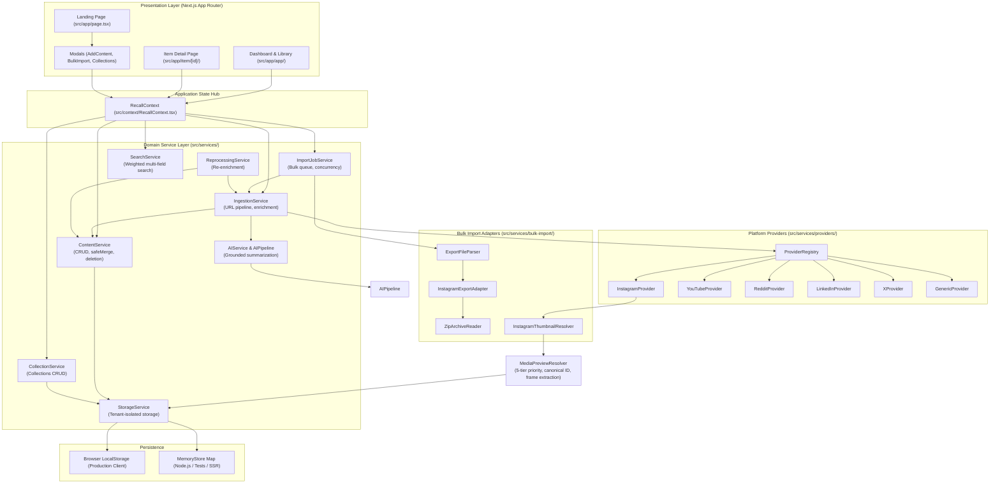

# Keeper — System Architecture

*Last Updated: 2026-10-02*

Keeper is architected as a modular Next.js application where UI components interact with a centralized client context (`RecallContext`), which delegates domain logic to specialized, decoupled service singletons.

---

## Architectural Diagram

---

## Core Service Catalog

### 1. `ContentService`
- **File**: [`src/services/content-service.ts`](file:///Volumes/T7/Devang/Code/Real_Project/Keeper/src/services/content-service.ts)
- **Responsibility**: Authoritative gatekeeper for item persistence, multi-user isolation, collection deletion, and the non-negotiable `safeMerge` immutability policy.
- **Inputs**: `SavedItem` entities, partial updates, user IDs, deletion options.
- **Outputs**: Sanitized, merged, and stored `SavedItem` objects; deletion results.
- **Key Methods**:
  - `safeMerge(existing, updates)`: Enforces source field precedence, URL immutability, and authentic thumbnail preservation.
  - `deleteCollectionItems(options)`: Handles collection-scoped deletion with multi-collection unlinking and multi-tenant checks.
  - `addItem(item, userId?)`, `updateItem(id, updates, userId?)`, `deleteItem(id, userId?)`.
- **Dependencies**: `StorageService`, `ProviderService`.
- **Major Callers**: `RecallContext`, `IngestionService`, `ReprocessingService`, `AIService`.

---

### 2. `IngestionService`
- **File**: [`src/services/ingestion-service.ts`](file:///Volumes/T7/Devang/Code/Real_Project/Keeper/src/services/ingestion-service.ts)
- **Responsibility**: Orchestrates the multi-stage URL ingestion lifecycle: validation, platform extraction, AI grounding, metadata normalization, and storage.
- **Inputs**: URL string, target collection ID, optional initial metadata (e.g. from bulk import), user ID.
- **Outputs**: `IngestionResult` containing `sourceData`, `aiEnrichment`, and persisted `savedItem`.
- **Pipeline Stages**:
  1. URL Validation & Canonicalization (via `ProviderRegistry`)
  2. Content Extraction & Fallback Protection (via Platform Provider)
  3. Grounded AI Enrichment (via `AIPipeline`)
  4. Metadata Normalization & Tag Sanitization (via `MetadataNormalizer`)
  5. Immutability Merge & Persistence (via `ContentService.safeMerge` and `ContentService.addItem`)
- **Dependencies**: `ProviderRegistry`, `AIPipeline`, `ContentService`, `MetadataNormalizer`.
- **Major Callers**: `RecallContext.addContent`, `ImportJobService.processItem`.

---

### 3. `ImportJobService`
- **File**: [`src/services/bulk-import/import-job-service.ts`](file:///Volumes/T7/Devang/Code/Real_Project/Keeper/src/services/bulk-import/import-job-service.ts)
- **Responsibility**: Manages the bulk import lifecycle, pre-import candidate analysis, concurrency queue execution, pause/resume, and progress reporting.
- **Inputs**: Parsed import candidates, job configuration (`ImportJobOptions`).
- **Outputs**: `ImportJob`, real-time progress callbacks, and `ImportReport`.
- **Features**:
  - `analyzeCandidates(candidates, existingItems)`: Computes exact 5-way breakdown (Detected, Ready, Already Saved, Batch Duplicates, Unsupported).
  - Queue execution with controlled concurrency (default 3, up to 5).
  - Deduplication handling (`skip`, `update`, `allow`).
  - Error classification into retryable categories (`rate_limit`, `timeout`) and permanent failures (`invalid_url`).
- **Dependencies**: `IngestionService`, `ProviderRegistry`, `StorageService`.
- **Major Callers**: Bulk Import UI (`src/components/bulk-import/`), API route (`src/app/api/bulk-import/jobs/`).

---

### 4. `AIPipeline` & `AIService`
- **Files**: [`src/services/ai-pipeline.ts`](file:///Volumes/T7/Devang/Code/Real_Project/Keeper/src/services/ai-pipeline.ts), [`src/services/ai-service.ts`](file:///Volumes/T7/Devang/Code/Real_Project/Keeper/src/services/ai-service.ts)
- **Responsibility**: Grounded content summarization, keyword and entity extraction, topic modeling, and natural language query answering.
- **Inputs**: `AuthoritativeSourceData`, list of existing collections, search queries.
- **Outputs**: `GroundedAIEnrichment` (summaries, topics, intent, tags) and `AIQueryResponse`.
- **Safety Invariant**: When source text is restricted or empty, AI marks status as `INSUFFICIENT_CONTENT` and outputs honest standard summaries instead of hallucinating.
- **Dependencies**: `MetadataNormalizer`.
- **Major Callers**: `IngestionService`, `ReprocessingService`, `RecallContext`.

---

### 5. `InstagramThumbnailResolver`
- **File**: [`src/services/media/instagram-thumbnail-resolver.ts`](file:///Volumes/T7/Devang/Code/Real_Project/Keeper/src/services/media/instagram-thumbnail-resolver.ts)
- **Responsibility**: Enforces source priority for Instagram thumbnails and strictly bans stock photography.
- **Source Priority**:
  1. Actual image/media in export archive (ZIP entry via `archiveFileResolver`)
  2. Explicit thumbnail URL supplied by export metadata
  3. Verified provider response (oEmbed API / Graph API)
  4. Public embed / OpenGraph live metadata
  5. Scoped cache hit (`instagram:${shortcode}`)
  6. Branded SVG vector placeholder (`INSTAGRAM_REEL_PLACEHOLDER`)
- **Safety Invariant**: Returns `status = "unavailable"` with explicit vector fallback when authentic media is absent. Unsplash, Matrix, and office wallpapers are blocked via `BANNED_STOCK_THUMBNAILS`.

---

### 6. `StorageService`
- **File**: [`src/services/storage-service.ts`](file:///Volumes/T7/Devang/Code/Real_Project/Keeper/src/services/storage-service.ts)
- **Responsibility**: Multi-tenant key-value storage abstraction. Uses browser `localStorage` in browser environments and an isolated in-memory `Map` during SSR or Node.js test execution.
- **Keys**: Prefixed by user ID (`keeper_items_user-123`, `keeper_collections_user-123`).
- **Dependencies**: None.
- **Major Callers**: `ContentService`, `CollectionService`, `ImportJobService`.
