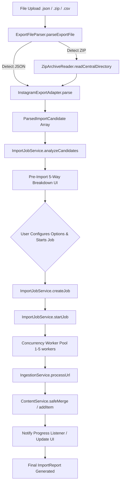

# Keeper — Bulk Import Subsystem

*Last Updated: 2026-10-02*

The Bulk Import subsystem orchestrates ingestion of large data exports (JSON, ZIP, CSV) from supported platforms into Keeper. It provides client-side pre-import analysis, concurrency-controlled queue execution, deduplication resolution, and resilient persistence.

---

## Supported Import Formats

| Format | Platform | Parser / Adapter | Structure Handled |
| :--- | :--- | :--- | :--- |
| **Instagram JSON (Legacy)** | Instagram | [`InstagramExportAdapter`](file:///Volumes/T7/Devang/Code/Real_Project/Keeper/src/services/bulk-import/adapters/instagram-export-adapter.ts) | `saved_saved_media` with `string_map_data["Saved on"]` containing `href` & `timestamp` |
| **Instagram JSON (Accounts Center)** | Instagram | [`InstagramExportAdapter`](file:///Volumes/T7/Devang/Code/Real_Project/Keeper/src/services/bulk-import/adapters/instagram-export-adapter.ts) | `saved_saved_media` with `string_list_data` arrays containing `href` & `timestamp` |
| **Instagram Saved Collections** | Instagram | [`InstagramExportAdapter`](file:///Volumes/T7/Devang/Code/Real_Project/Keeper/src/services/bulk-import/adapters/instagram-export-adapter.ts) | `saved_collections` containing named sub-folders and items |
| **Meta Full ZIP Archive** | Instagram | [`ZipArchiveReader`](file:///Volumes/T7/Devang/Code/Real_Project/Keeper/src/services/bulk-import/adapters/zip-archive-reader.ts) | Reads Central Directory without full memory extraction, safely extracts JSON entries |
| **YouTube Takeout CSV** | YouTube | [`ExportFileParser`](file:///Volumes/T7/Devang/Code/Real_Project/Keeper/src/services/bulk-import/export-parser.ts#L60) | CSV rows containing `Video ID`, `Title`, `Channel`, and `Watch URL` |
| **Raw URL List** | Universal | [`ExportFileParser`](file:///Volumes/T7/Devang/Code/Real_Project/Keeper/src/services/bulk-import/export-parser.ts#L80) | Plain text file containing one URL per line |

---

## End-to-End Processing Architecture

---

## Subsystem Components

### 1. `ZipArchiveReader`
- **File**: [`src/services/bulk-import/adapters/zip-archive-reader.ts`](file:///Volumes/T7/Devang/Code/Real_Project/Keeper/src/services/bulk-import/adapters/zip-archive-reader.ts)
- **Zero-Dependency Architecture**: Lightweight byte-level reader parsing Central Directory headers from the end of the archive.
- **Security Limits**:
  - Max archive size: 100 MB (`DEFAULT_LIMITS.maxArchiveSizeBytes`)
  - Max entries inspected: 1,000
  - Path traversal protection: Rejects entries containing `..` or absolute paths
  - Binary exclusion: Skips video/audio payload to prevent browser memory exhaustion.

### 2. `InstagramExportAdapter`
- **File**: [`src/services/bulk-import/adapters/instagram-export-adapter.ts`](file:///Volumes/T7/Devang/Code/Real_Project/Keeper/src/services/bulk-import/adapters/instagram-export-adapter.ts)
- **Mojibake Correction**: Automatic repair of UTF-8 strings encoded as ISO-8859-1 (a standard Meta export bug where accents and emojis appear corrupted).
- **Extraction**: Maps `title`, `caption`, `creatorName`, `savedTimestamp`, `fbid`, and `shortcode` into normalized candidates.

### 3. `ImportJobService`
- **File**: [`src/services/bulk-import/import-job-service.ts`](file:///Volumes/T7/Devang/Code/Real_Project/Keeper/src/services/bulk-import/import-job-service.ts)
- **Pre-Import Analysis**: `analyzeCandidates(candidates, existingItems)` partitions candidates into:
  - **Ready**: Valid candidates not currently in the user's library.
  - **Already Saved**: Candidates whose canonical URL is already present in Keeper.
  - **Batch Duplicates**: Duplicates appearing more than once within the uploaded file.
  - **Unsupported**: Malformed or unparseable URLs.
- **Worker Concurrency**: Runs worker loops bounded by `concurrencyLimit` (default: 3).
- **Error Classification**:
  - `rate_limit`, `timeout`, `network`: Categorized as **Retryable**.
  - `invalid_url`, `unsupported_source`: Categorized as **Non-retryable**.

---

## Critical Invariants in Bulk Import

1. **Non-Negotiable Data Retention**:
   Valid export data (URL, creator, caption, timestamp) must NEVER be discarded because optional network enrichment timed out or encountered restricted guest HTML.
2. **Duplicate Strategy Enforcement**:
   - `skip`: Preserves existing item and marks import candidate as `"skipped"`.
   - `update`: Enriches existing item via [`ContentService.safeMerge`](file:///Volumes/T7/Devang/Code/Real_Project/Keeper/src/services/content-service.ts#L150) without overwriting authoritative export data.
   - `allow`: Creates a separate entry.
3. **Tenant Boundary Enforcement**:
   An import job created by User A cannot target or write to collections belonging to User B.
# 2026-10-07 server import boundary

Browser bulk processing now sends each candidate through authenticated `POST /api/ingest` with a stable `jobId:itemId` idempotency key and the workspace's collections. This applies the Postgres deduplication/credit ledger/job transaction for CSV/JSON/URL imports as well as single URLs. Existing in-memory client progress/report state remains a separate UI concern; durable AI jobs live in `keeper_ai_jobs` and are polled/claimed by the worker described in `AI_MEDIA_ARCHITECT.md`.
