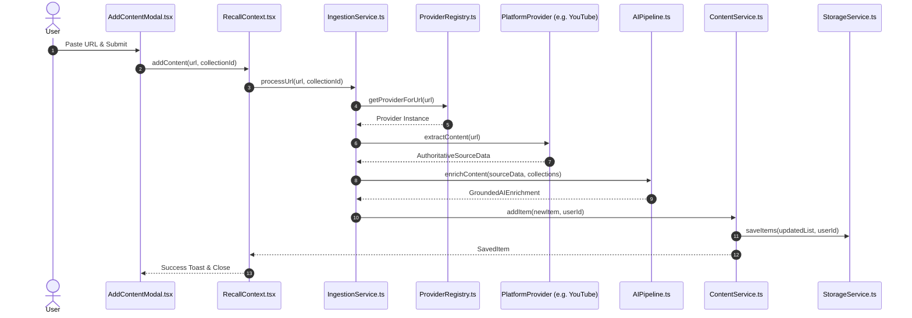
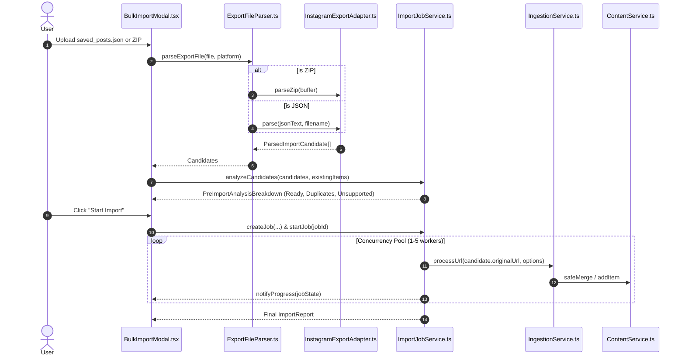

# Keeper — End-to-End Data Flows

*Last Updated: 2026-10-02*

This document traces the 5 critical end-to-end operational data paths through the Keeper codebase.

---

## 1. Single Content Import Flow



### Trace:
1. `AddContentModal` invokes `RecallContext.addContent(url, collectionId)`.
2. `IngestionService.processUrl` canonicalizes the URL via `ProviderRegistry`.
3. The platform provider fetches metadata (oEmbed, OpenGraph, or API) into `AuthoritativeSourceData`.
4. `AIPipeline.enrichContent` produces multi-tier summaries, tags, topics, and intent.
5. `IngestionService` constructs the `SavedItem` record and commits it via `ContentService.addItem`.
6. `StorageService` serializes items to storage and returns the new item to update the UI state.

---

## 2. Bulk Import Flow (JSON / ZIP)



### Trace:
1. User drops a file (e.g. `saved_posts.json` or `export.zip`).
2. `ExportFileParser` delegates to `InstagramExportAdapter` (or `ZipArchiveReader` if binary ZIP).
3. Extracted entries are converted into `ParsedImportCandidate[]` preserving `title`, `creatorName`, `caption`, `savedTimestamp`, and `thumbnailUrl`.
4. `ImportJobService.analyzeCandidates` matches candidates against existing items to calculate the 5-way breakdown without saving anything.
5. When started, `ImportJobService` spins up worker promises bounded by `concurrencyLimit` (default 3).
6. Each item runs through `IngestionService.processUrl`. If the item exists and `duplicateStrategy = "update"`, `ContentService.safeMerge` merges data without overwriting export facts.

---

## 3. Item Reprocessing Flow

```mermaid
flowchart TD
    A[User clicks 'Reprocess' in Item Detail] --> B[ReprocessingService.reprocessItem(id)]
    B --> C[Fetch existing SavedItem from ContentService]
    C --> D[Re-run IngestionService.processUrl for fresh enrichment]
    D --> E[AIPipeline re-extracts summaries, topics, & tags]
    E --> F[ContentService.safeMerge(existingItem, refreshedItem)]
    F -->|Enforce Precedence| G{Did URL or Creator Change?}
    G -->|Yes| H[REJECT MUTATION: Keep original source facts]
    G -->|No| I[ACCEPT ENRICHMENT: Update summary, topics, & tags]
    H --> J[Commit to StorageService]
    I --> J
    J --> K[RecallContext updates detail view]
```

### Trace:
1. `src/app/item/[id]/page.tsx` triggers `ReprocessingService.reprocessItem(id)`.
2. Existing authoritative data is retrieved from storage.
3. Ingestion pipeline re-evaluates the canonical URL and triggers fresh AI enrichment.
4. **Crucial Safety Gate**: `ContentService.safeMerge` merges the newly derived fields (`aiSummary`, `topics`, `tags`, `thumbnail`) into the stored item while strictly forbidding changes to `url`, `creator`, `savedDate`, or original `description`.

---

## 4. Collection Delete & Multi-Collection Unlinking Flow

```mermaid
flowchart TD
    A[User triggers Delete Collection] --> B[DeleteConfirmModal]
    B --> C[ContentService.deleteCollectionItems(options)]
    C --> D[Verify collection ownership for target userId]
    D --> E[Filter items in target collection]
    E --> F{Does item belong to OTHER collections?}
    F -->|Yes: Multi-Collection Item| G[Unlink: Remove target collectionId from item.collections]
    F -->|No: Sole-Collection Item| H[Move to Trash: Set item.trashed = true]
    G --> I[Save updated list to StorageService]
    H --> I
    I --> J[Return DeleteCollectionItemsResult to UI]
```

### Trace:
1. In `src/app/app/collections/page.tsx`, user selects "Delete Collection".
2. `ContentService.deleteCollectionItems` validates that `collectionId` belongs to the requesting `userId`.
3. For each affected item:
   - If the item belongs to additional collections (`item.collections.length > 1`), it is **unlinked** from the deleted collection; the item remains active in the library.
   - If this was the item's sole collection, the item is moved to Trash (`trashed = true`).
4. Result metrics (`deleted`, `removedFromCollection`, `skipped`) are returned and displayed in a confirmation toast.

---

## 5. Full-Text Search Flow

```mermaid
flowchart LR
    A[User types query] --> B[RecallContext.setSearchQuery]
    B --> C[SearchService.search(query, userId, filters)]
    C --> D[Retrieve user items from StorageService]
    D --> E[Normalize query & tokenize into terms]
    E --> F[Score items across 6 weighted fields]
    F --> G[Apply filters: platform, collection, tag, date]
    G --> H[Sort by relevance score]
    H --> I[Render SearchResult[] in Library / Search view]
```

### Trace:
1. User types in search bar; query is debounced to `RecallContext.setSearchQuery`.
2. `SearchService.search` scores all active, non-trashed items against terms across:
   - `title` (weight: 10)
   - `creator.name` (weight: 8)
   - `tags` & `topics` (weight: 6)
   - `aiSummary.quick` (weight: 4)
   - `description` / `caption` (weight: 3)
   - `metadata.domain` (weight: 1)
3. Results matching the threshold are returned with relevance scores and highlighted matches.
