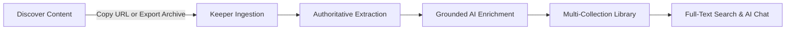

# Keeper — Project Overview

*Last Updated: 2026-10-02*

Keeper is a universal bookmarking, content curation, and personal knowledge repository built for creators, researchers, and engineers who collect high-signal media across social platforms and the web.

---

## Target Workflow

1. **Capture**: User pastes an arbitrary link (YouTube, Instagram, Reddit, X, LinkedIn, or article) into the Quick Save modal or uploads a full platform export archive (Instagram JSON/ZIP, YouTube Takeout CSV).
2. **Normalize & Ingest**: Provider architecture normalizes tracking parameters, extracts canonical content identities (shortcodes, video IDs), and preserves author and caption facts.
3. **Enrich**: AI pipeline processes extracted evidence into three tiers of summaries, extracts intent, tags, and topics, without hallucinating.
4. **Organize**: Content is assigned to collections (single or multiple), tagged, favorited, or archived.
5. **Recall**: User queries their library via weighted full-text search or interacts with the conversational AI Assistant that cites saved items.

---

## Feature Status Breakdown

### IMPLEMENTED (Production Ready & Verified)

- **Universal Single URL Ingestion**:
  - Ingests URLs from YouTube, YouTube Shorts, Instagram (posts/reels), Reddit, LinkedIn, X (Twitter), and general web articles.
  - Normalizes canonical URLs, stripping tracking parameters (`utm_source`, `igsh`, `si`).
  - Graceful fallbacks when platform content is login-restricted or rate-limited.
- **Bulk Import Engine**:
  - Official Meta/Instagram JSON formats (`saved_saved_media` with `string_map_data` or `string_list_data`).
  - Meta Export ZIP archives with automated file detection, boundary checks, and decompression.
  - YouTube Takeout CSV format parsing.
  - Pre-import 5-way breakdown: Total Detected, Ready, Already Saved, Batch Duplicates, and Unsupported.
  - Asynchronous concurrency worker queue (1–5 concurrent requests) with real-time progress callbacks.
  - Duplicate resolution strategies: `skip`, `update`, and `allow`.
- **Data Integrity & Immutability**:
  - `ContentService.safeMerge` enforcing strict source precedence: Meta export values supersede scraped guest data.
  - URL immutability invariant preventing accidental shortcode/identity corruption.
  - Authentic thumbnail protection preventing downgrade to generic fallback graphics.
- **Library & Organization**:
  - Custom user collections and system default collections.
  - Multi-collection support (`item.collectionId` primary + `item.collections` array).
  - Production collection deletion with multi-collection unlinking (items belonging to other collections are unlinked rather than trashed; sole-collection items move to Trash).
  - Favorites, Recent items tracking, Archive, and Trash bin (restore / permanent delete).
- **Grounded AI Enrichment**:
  - 3-tier summaries: `quick` (1-sentence TL;DR), `standard` (2-3 sentences), `detailed` (full breakdown).
  - Strict intent categorization: `TUTORIAL`, `RESOURCE`, `NEWS`, `opinion`, `technical`, `inspiration`, `bookmark`.
  - Evidence-grounded fallbacks for restricted guest content (`INSUFFICIENT_CONTENT` status).
- **Search & Exploration**:
  - Weighted multi-field client-side search (scoring title, creator, tags, topics, description, and AI summaries).
  - Search filters by platform, content type, collection, tag, and date range.
- **UI & Aesthetics**:
  - High-polish Krackerz editorial design system on landing page.
  - Clean, dark-mode-first dashboard with reactive toast notifications and micro-interactions.

---

### PARTIAL (Functional with Known Environmental Limits)

- **Authentic Instagram Thumbnail Acquisition**:
  - **Status**: LIMITED.
  - **Working**: If an export contains media attachments (`media/posts/*.jpg` in ZIP) or if the provider response contains verified media, it is acquired and preserved.
  - **Limit**: Public unauthenticated scraping of Instagram Reels is blocked by Meta without server-side Graph API credentials (`META_APP_ACCESS_TOKEN`). When unavailable, Keeper displays an honest vector placeholder card (`INSTAGRAM_REEL_PLACEHOLDER`) rather than fake stock photos.
- **AI Chat Assistant**:
  - **Status**: Implemented with local keyword-grounded search and insight synthesis over saved items. Deep LLM external API calling (OpenAI/Anthropic) is configured as mockable/local fallback.
- **OAuth Direct Import**:
  - **Status**: Framework implemented in `OAuthSecurityService` (CSRF state verification, PKCE), but external OAuth apps for Meta/YouTube require production client IDs and platform verification.

---

### PLANNED (Not Yet Implemented)

- **Browser Extension**: 1-click capture extension for Chrome/Firefox/Safari.
- **Automated Video Audio Transcription (Whisper API)**: Local mock exists in `TranscriptionService`; real-time server-side speech-to-text integration is planned.
- **OCR / Frame Analysis for Reels/Shorts**: Planned background worker for keyframe visual text extraction via Tesseract / Vision AI.
- **Multi-device Cloud Sync**: Currently persists to browser storage (`localStorage`) and server in-memory cache; dedicated database (PostgreSQL/Supabase/Prisma) is planned for multi-device sync.
