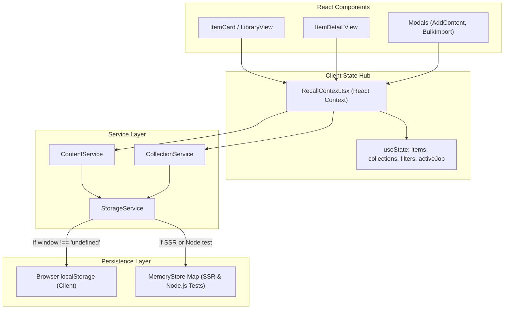

# Keeper — Storage & State Management

*Last Updated: 2026-10-02*

This document explains where data lives in Keeper, how client state syncs with persistence, and how tenant isolation is guaranteed.

---

## State & Storage Architecture

---

## The Storage Layer (`StorageService`)

Located in [`src/services/storage-service.ts`](file:///Volumes/T7/Devang/Code/Real_Project/Keeper/src/services/storage-service.ts):

### 1. Dual-Mode Storage Adapter
- **Browser Environment**: Direct access to `window.localStorage`.
- **Server-Side Rendering / Node.js Test Harness**: High-performance in-memory `Map<string, string>` fallback (`memoryStore`).
- **Why it matters**: Allows all services and test runners to execute without `window` mocks while preventing tests from mutating real developer data.

### 2. Multi-Tenant Key Isolation
All storage keys are namespaced by `userId`:
- Items Key: `keeper_items_${userId}` (default: `keeper_items_anonymous`)
- Collections Key: `keeper_collections_${userId}` (default: `keeper_collections_anonymous`)
- Active Job Key: `keeper_active_job_${userId}`
- User Session Key: `keeper_auth_session`

When a new user context is initialized, default system collections (`INITIAL_COLLECTIONS` from [`src/data/seed-data.ts`](file:///Volumes/T7/Devang/Code/Real_Project/Keeper/src/data/seed-data.ts)) are provisioned into the user's isolated store.

---

## Centralized React Context (`RecallContext`)

Located in [`src/context/RecallContext.tsx`](file:///Volumes/T7/Devang/Code/Real_Project/Keeper/src/context/RecallContext.tsx):

### Managed State:
- `items: SavedItem[]`: Full library of items for the active user.
- `collections: Collection[]`: Active user collections.
- `selectedCollectionId: string | null`: Active collection filter.
- `searchQuery: string`: Active search input.
- `selectedPlatform: Platform | "all"`: Platform filter.
- `selectedContentType: ContentType | "all"`: Content type filter.
- `viewMode: ViewMode`: `"grid"` | `"list"` | `"compact"`.
- `toasts: ToastMessage[]`: Active toast notification queue.
- `activeJob: ImportJob | null`: Currently executing or paused bulk import job.

### Primary Mutation Handlers:
- `addContent(url, collectionId)`: Ingests a single URL and adds the resulting `SavedItem`.
- `updateItem(id, updates)`: Routes updates through `ContentService.updateItem` (which applies `safeMerge`).
- `deleteItem(id)`: Soft-deletes an item (sets `trashed = true`).
- `deleteMultipleItems(ids)`: Bulk moves multiple items to Trash.
- `deleteCollectionItems(options)`: Collection-scoped deletion with multi-collection unlinking.
- `restoreFromTrash(id)`: Restores a soft-deleted item.
- `emptyTrash()`: Permanently deletes all items marked `trashed = true`.

---

## Safe Mutation Invariants

To avoid accidental state corruption, all code modifying `SavedItem` must adhere to these rules:

1. **Never Bypass `ContentService.safeMerge`**:
   Direct `localStorage.setItem` or raw `{ ...existing, ...updates }` spread is forbidden. Updates must go through `ContentService.updateItem` or `ContentService.safeMerge` to protect authoritative source fields.
2. **Atomic Writes**:
   `StorageService.saveItems` writes the full serialized array atomically, preventing partial corruption.
3. **Multi-Collection Integrity**:
   When an item is added to multiple collections, both `item.collectionId` (primary) and `item.collections` (array of all collection IDs) must be maintained in sync.
