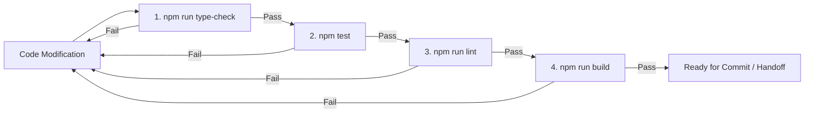

# Keeper — Testing & Validation Guide

*Last Updated: 2026-10-02*

For the GitHub Actions implementation, Vercel production release gates, required repository settings, and current lint-warning baseline, see [`ai/CI_CD.md`](CI_CD.md).

Keeper enforces a strict four-gate validation pipeline for all code modifications. Every change must pass typecheck, unit/integration tests, linting, and a production build before being declared complete.

---

## The Four Validation Gates



### 1. TypeScript Strict Typecheck
```bash
npm run type-check
```
- Executes `tsc --noEmit` against `tsconfig.json`.
- **Standard**: 0 errors. Never use `@ts-ignore` or broad `any` to silence errors.

### 2. Automated Test Suite
```bash
npm test
```
- Runs [`scripts/run-tests.ts`](file:///Volumes/T7/Devang/Code/Real_Project/Keeper/scripts/run-tests.ts) via Node.js and `tsx`.
- Runs 110+ assertions across 24 test suites in sub-second time.
- **Standard**: 0 failed assertions.

### 3. ESLint Verification
```bash
npm run lint
```
- Executes Next.js ESLint rules (`eslint-config-next`).
- **Standard**: 0 warnings, 0 errors.

### 4. Production Next.js Bundle Build
```bash
npm run build
```
- Compiles the full App Router production bundle (`next build`).
- Verifies that all pages, API routes, and Server/Client Component boundaries compile without runtime errors.
- **Standard**: Clean build output.

---

## Test Suite Inventory (`scripts/run-tests.ts`)

The test suite covers:
1. **Authentication & Cryptography**: Password hashing, salt validation, initials generation.
2. **YouTube Provider**: Watch URLs, Shorts, youtu.be, 11-char video ID extraction.
3. **Instagram Provider & Mojibake**: Shortcode parsing, URL cleaning, encoding repair.
4. **Ingestion Pipeline**: Multi-platform extraction, canonicalization, error handling.
5. **Grounded AI Enrichment**: 3-tier summaries, fallback behavior on restricted content.
6. **Deduplication & Idempotency**: URL normalization, batch duplicate detection.
7. **Export File Parsers**: Legacy and modern Meta JSON formats, Takeout CSV.
8. **Bulk Import Job Execution**: Concurrency pools, pause/resume, progress listeners.
9. **Error Classification & Retry**: Retryable (timeout, rate limit) vs non-retryable (invalid URL).
10. **Scalability**: Simulated 1,000+ item candidate parsing and breakdown speed.
11. **Multi-User Security & Workspace Isolation**: Tenant isolation of items and collections.
12. **OAuth Security**: CSRF state, PKCE verification, AES token encryption.
13. **Cross-Platform Metadata Normalizer**: Tag sanitization, Mojibake repair.
14. **System Migration Service**: Schema upgrade compatibility.
15. **Real AI Pipeline Fallbacks**: Zero content loss on restricted guest content.
16. **Instagram Official Export Adapter & ZIP Verification**: Central Directory security limits.
17. **Full End-to-End Pipeline**: Simulated network ingestion to persistent storage.
18. **Multi-Tenant Collection Security**: Rejection of cross-tenant collection assignment.
19. **Instagram JSON Accuracy**: Verification of creator and caption fidelity.
20. **Production Collection Delete**: Single/bulk collection deletion and multi-collection unlinking.
21. **Thumbnail Resolver & Stock Photo Ban**: Verification that Unsplash/Matrix photos are banned.
22. **StorageService In-Memory Resiliency**: Isolated store for SSR/Node.js environments.
23. **High-Concurrency Bulk Import Simulation**: 20-item parallel batch import with thumbnail tracking.
24. **P0 Data Immutability & Production Invariants**: Regression verification for URL, creator, caption, and saved date immutability across AI, thumbnail resolution, reprocessing, and storage reload.

---

## Supplementary Developer Scripts

- **`npm run smoke-test`**: Rapid sanity test (`scripts/smoke-test.ts`) validating basic ingestion and provider routing.
- **`npm run audit:design`**: Audits Tailwind design tokens and color palette usage (`scripts/palette-audit.ts`).
- **`npm run dev`**: Starts local Next.js development server on `http://localhost:3000`.
